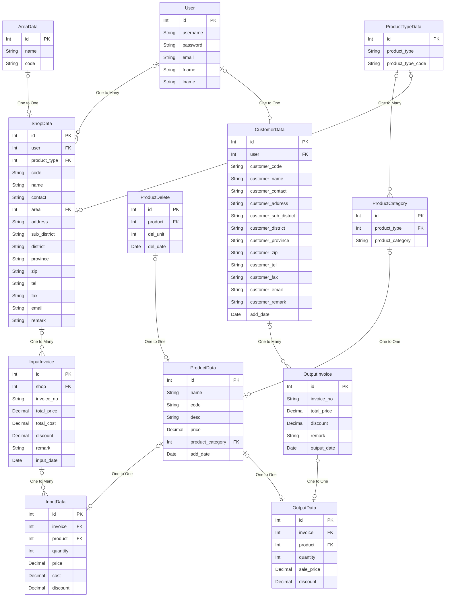

# Stores

## Entity Relations Diagram (ERD)

```mermaid

erDiagram
    User {
        Int id PK
        String username
        String password
        String email
        String fname
        String lname
    }

    ProductTypeData {
        Int id PK
        String product_type
        String product_type_code
    }

    ProductCategory {
        Int id PK
        Int product_type FK
        String product_category
    }

    ProductData {
        Int id PK 
        String name
        String code
        String desc
        Decimal price
        Int product_category FK
        Date add_date
    }

    ProductDelete {
        Int id PK
        Int product FK
        Int del_unit
        Date del_date
    }

    AreaData {
        Int id PK
        String name
        String code
    }

    ShopData {
        Int id PK
        Int user FK
        Int product_type FK
        String code
        String name
        String contact
        Int area FK
        String address
        String sub_district
        String district
        String province
        String zip
        String tel
        String fax
        String email
        String remark
    }

    InputInvoice {
        Int id PK
        Int shop FK
        String invoice_no
        Decimal total_price
        Decimal total_cost
        Decimal discount
        String remark
        Date input_date
    }

    InputData {
        Int id PK
        Int invoice FK
        Int product FK
        Int quantity
        Decimal price
        Decimal cost
        Decimal discount
    }

    CustomerData {
        Int id PK
        Int user FK
        String customer_code
        String customer_name
        String customer_contact
        String customer_address
        String customer_sub_district
        String customer_district
        String customer_province
        String customer_zip
        String customer_tel
        String customer_fax
        String customer_email
        String customer_remark
        Date add_date

    }

    OutputInvoice {
        Int id PK
        String invoice_no
        Decimal total_price
        Decimal discount
        String remark

        Date output_date
    }

    OutputData {
        Int id PK
        Int invoice FK
        Int product FK
        Int quantity 
        Decimal sale_price
        Decimal discount
    }


    ProductTypeData |o--o{ ProductCategory : "One to Many"
    ProductCategory |o--o| ProductData : "One to One"
    ProductDelete |o--o| ProductData : "One to One"

    User |o--o{ ShopData : "One to Many"
    AreaData |o--o| ShopData : "One to One"
    ProductTypeData |o--o| ShopData : "One to One"

    ShopData |o--o{ InputInvoice : "One to Many"
    InputInvoice |o--o{ InputData : "One to Many"
    ProductData |o--o| InputData : "One to One"

    User |o--o| CustomerData : "One to One"
    CustomerData |o--o{ OutputInvoice : "One to Many"
    OutputInvoice |o--o| OutputData : "One to One"
    ProductData |o--o| OutputData : "One to One"
```
