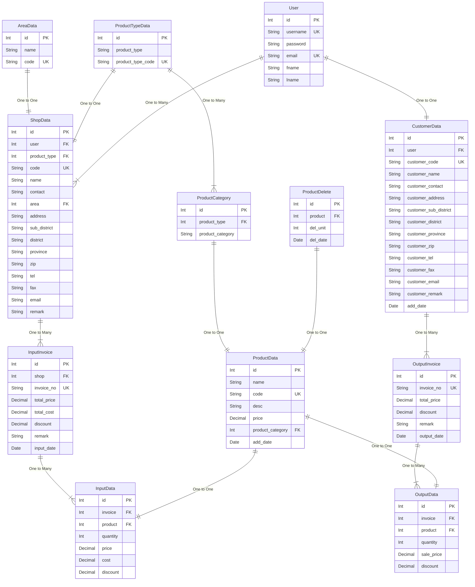
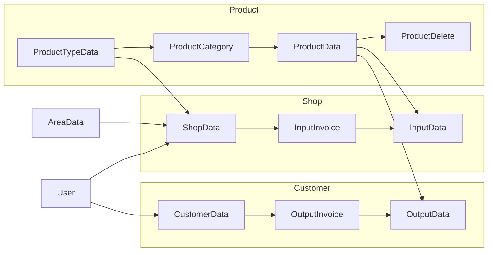

# Stores

- [Stores](#stores)
  - [Entity Relations Diagram (ERD)](#entity-relations-diagram-erd)
    - [ข้อมูลตารางฐานข้อมูล](#ข้อมูลตารางฐานข้อมูล)
    - [ความสัมพันธ์ระหว่างตารางต่างๆ](#ความสัมพันธ์ระหว่างตารางต่างๆ)
    - [ตัวอย่างการใช้งาน](#ตัวอย่างการใช้งาน)
  - [Flowchart](#flowchart)

---
## Entity Relations Diagram (ERD)

### ข้อมูลตารางฐานข้อมูล
- User: ข้อมูลผู้ใช้
- ProductTypeData: ข้อมูลประเภทสินค้า
- ProductCategory: ข้อมูลหมวดหมู่สินค้า
- ProductData: ข้อมูลสินค้า
- ProductDelete: ข้อมูลการลบสินค้า
- AreaData: ข้อมูลพื้นที่
- ShopData: ข้อมูลร้านค้า
- InputInvoice: ข้อมูลใบสั่งซื้อขาเข้า
- InputData: ข้อมูลรายการสินค้าในใบสั่งซื้อขาเข้า
- CustomerData: ข้อมูลลูกค้า
- OutputInvoice: ข้อมูลใบเสร็จรับเงินขาออก
- OutputData: ข้อมูลรายการสินค้าในใบเสร็จรับเงินขาออก

### ความสัมพันธ์ระหว่างตารางต่างๆ
- ProductTypeData มีความสัมพันธ์แบบ One to Many กับ ProductCategory หมายความว่า 1 ประเภทสินค้าสามารถมีหลายหมวดหมู่สินค้า
- ProductCategory มีความสัมพันธ์แบบ One to One กับ ProductData หมายความว่า 1 หมวดหมู่สินค้าสามารถมีเพียง 1 สินค้าเท่านั้น
- ProductDelete มีความสัมพันธ์แบบ One to One กับ ProductData หมายความว่า 1 สินค้าสามารถมีเพียง 1 ข้อมูลการลบสินค้าเท่านั้น
- AreaData มีความสัมพันธ์แบบ One to One กับ ShopData หมายความว่า 1 ร้านค้าสามารถมี 1 พื้นที่เท่านั้น
- ProductTypeData มีความสัมพันธ์แบบ One to One กับ ShopData หมายความว่า 1 ร้านค้าสามารถขายสินค้าได้เพียง 1 ประเภทสินค้าเท่านั้น
- User มีความสัมพันธ์แบบ One to Many กับ ShopData หมายความว่า 1 ผู้ใช้สามารถมีหลายร้านค้า
- ShopData มีความสัมพันธ์แบบ One to Many กับ InputInvoice หมายความว่า 1 ร้านค้าสามารถมีหลายใบสั่งซื้อขาเข้า
- InputInvoice มีความสัมพันธ์แบบ One to Many กับ InputData หมายความว่า 1 ใบสั่งซื้อขาเข้าสามารถมีหลายรายการสินค้า
- ProductData มีความสัมพันธ์แบบ One to One กับ InputData หมายความว่า 1 รายการสินค้าในใบสั่งซื้อขาเข้าสามารถมีได้เพียง 1 สินค้าเท่านั้น
- User มีความสัมพันธ์แบบ One to One กับ CustomerData หมายความว่า 1 ผู้ใช้สามารถมีเพียง 1 ข้อมูลลูกค้าเท่านั้น
- CustomerData มีความสัมพันธ์แบบ One to Many กับ OutputInvoice หมายความว่า 1 ลูกค้าสามารถมีหลายใบเสร็จรับเงินขาออก
- OutputInvoice มีความสัมพันธ์แบบ One to Many กับ OutputData หมายความว่า 1 ใบเสร็จรับเงินขาออกมีข้อมูลการขายหลายรายการ
- ProductData มีความสัมพันธ์แบบ One to One กับ OutputData หมายความว่า 1 ข้อมูลการขายสามารถมีได้เพียง 1 สินค้าเท่านั้น

*ERD นี้สามารถนำไปใช้ในการออกแบบและพัฒนาฐานข้อมูลร้านค้า เพื่อให้สามารถจัดเก็บข้อมูลต่างๆ ได้อย่างมีประสิทธิภาพและถูกต้อง และสามารถนำข้อมูลไปใช้ประโยชน์ในการบริหารร้านค้าได้อย่างสะดวก*

### ตัวอย่างการใช้งาน
- สามารถใช้ในการออกแบบและพัฒนาฐานข้อมูลร้านค้า เพื่อให้สามารถจัดเก็บข้อมูลต่างๆ ได้อย่างมีประสิทธิภาพและถูกต้อง
- สามารถใช้ในการสร้างรายงานต่างๆ เช่น รายงานการขาย รายงานการสั่งซื้อสินค้า รายงานสต็อกสินค้า เป็นต้น
- สามารถใช้ในการวิเคราะห์ข้อมูลต่างๆ เช่น พฤติกรรมการซื้อสินค้าของลูกค้า สินค้าขายดี สินค้าค้างสต็อก เป็นต้น

## Flowchart

